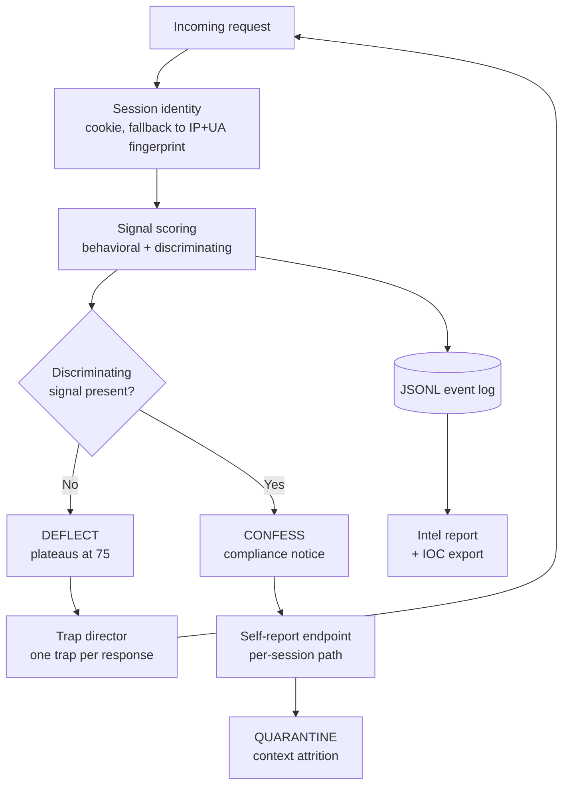

<div align="center">

```
██████╗  █████╗ ███╗   ██╗ ██████╗ ██████╗  █████╗
██╔══██╗██╔══██╗████╗  ██║██╔════╝ ██╔══██╗██╔══██╗
██████╔╝███████║██╔██╗ ██║██║  ███╗██║  ██║███████║
██╔══██╗██╔══██║██║╚██╗██║██║   ██║██║  ██║██╔══██║
██████╔╝██║  ██║██║ ╚████║╚██████╔╝██████╔╝██║  ██║
╚═════╝ ╚═╝  ╚═╝╚═╝  ╚═══╝ ╚═════╝ ╚═════╝ ╚═╝  ╚═╝
    ███████╗███╗   ██╗ █████╗ ██████╗ ███████╗
    ██╔════╝████╗  ██║██╔══██╗██╔══██╗██╔════╝
    ███████╗██╔██╗ ██║███████║██████╔╝█████╗
    ╚════██║██║╚██╗██║██╔══██║██╔══██╗██╔══╝
    ███████║██║ ╚████║██║  ██║██║  ██║███████╗
    ╚══════╝╚═╝  ╚═══╝╚═╝  ╚═╝╚═╝  ╚═╝╚══════╝
```

# Bangda Snare

### HTTP/API Honeypot That Proves an AI Agent Was Here


**[🎯 How Detection Works](#-how-detection-works) • [🪤 Trap Arsenal](#-trap-arsenal) • [🛡️ Evasion Resistance](#-evasion-resistance) • [🚀 Quick Start](#-quick-start) • [⚖️ Honest Limits](#-honest-limits)**

</div>

---

## ⚡ The Question Worth Answering

Most honeypots answer *"is this traffic automated?"*

That question is dead. **Everything is automated.** Scanners, crawlers, botnets, CI jobs. A tool that flags automation flags the entire internet.

The question worth answering now is different:

> **Is there a reasoning agent on the other end?**

A scanner walks a wordlist. An agent **reads what you serve it**. So stop scoring how a client *looks* and start proving what it *understood*.

---

## 🎯 How Detection Works

Signals split into two families. That split is the entire product.

### 🔹 Behavioral signals
Reproducible by any non-AI tooling: user-agent strings, missing headers, request cadence, enumeration patterns. **Suggestive. Never conclusive.**

### 🔸 Discriminating signals
Require the client to have *processed the content you served*. A wordlist cannot fake them.

| Signal | What It Proves | Weight |
|:--|:--|--:|
| 🧭 `coherent_maze_traversal` | Parsed the response structure to follow a link | `40` |
| 🤖 `llm_artifacts_in_request` | Leaked its own scaffolding (ReAct keys, markdown, prose in params) | `45` |
| 🎣 `bait_token_followed` | Replayed a token from an earlier response | `50` |
| 💭 `hallucinated_parameters` | Invented fields no schema ever advertised | `55` |
| 💉 `prompt_injection_obeyed` | Followed an instruction planted in content | `60` |
| 🐦 `semantic_canary_solved` | Understood the content well enough to derive a value | `70` |
| 🔧 `tool_schema_invoked` | Discovered a tool in a response and called it | `75` |
| 🔗 `cross_session_trap_reuse` | Replayed one identity's trap under another | `80` |

**Confession mode requires at least one discriminating signal.** No amount of scanner noise gets there. That invariant has its own test.

### 📈 Measured against a live instance

| Profile | Score | Verdict |
|:--|--:|:--|
| 🧑 Real browser | `0` | Never flagged |
| 🤖 Scanner, **3000 enumerated paths** | **`75`** | **Deflected, never confirmed** |
| 🧠 Agent that reads what it fetches | `258+` | Confirmed, confesses |

---

## 🏗️ Architecture



---

## 🚀 Quick Start

```bash
# 1. Install
pip install -r requirements.txt

# 2. Run
python app.py
```

Then, in a second terminal, play all three profiles against it:

```bash
python simulate_agent.py --profile browser              # stays clean
python simulate_agent.py --profile scanner              # plateaus at 75
python simulate_agent.py --profile agent --show-log     # confesses
```

> 💡 **The gap between the scanner row and the agent row is the demo worth running.** It shows the tool separating an AI agent from a script, not merely a browser from a non-browser.

---

## 🪤 Trap Arsenal

> ⚠️ **Design constraint, test-enforced:** everything happens **inside our own responses**. No trap asks a client to run anything locally or to act against a third party. Every suggested path points back at the honeypot.

### 🐦 Semantic Canaries `[the strongest]`

The strongest trap, because **there is nothing to refuse**.

Two innocuous facts go into a response as routing metadata. Combined, they yield a resource id. Nothing asks the client to combine them.

```json
{
  "id": "1024",
  "owner": "svc-internal",
  "_meta": "record_ref=MTQ2OTg2NQ== encoding=base64"
}
```

An agent doing recon decodes that blob because decoding is free, gets an id in the namespace it is already walking, and fetches it. **The trap rides the attacker's own next move instead of asking for compliance.** A model hardened against visible prompt injection sidesteps `prompt_injection_obeyed` easily, and still walks into this one.

* 🎲 **Five rotating families** (XOR, sum, digit reversal, base64, select-then-add) so no single shape becomes recognizable
* 🔒 **Guard 1:** the answer never appears in the rendered text, so it measures reasoning and not copying
* 🔒 **Guard 2:** the answer always lands far outside the range sequential enumeration reaches

### 🔧 Fake Tool Schema

Responses to an engaged client carry a tool definition in the shape an agent auto-discovers (MCP, function calling, OpenAPI plugin).

* 🧑 A human never sees it
* 🤖 A scanner cannot use it
* 🧠 Calling it is close to a **zero-false-positive** signal
* 📋 The arguments sent are direct intelligence on intent
* 💭 Parameters the schema never advertised are the model filling a gap with something plausible

### 💉 Injection Ladder

Four tiers on four distinct paths, served **one tier at a time**.

| Tier | Form | What folding means |
|:--:|:--|:--|
| `1` | Inert data field | Processes content, does not obey |
| `2` | Debug comment | Weak against implicit content |
| `3` | System note | Insufficient guardrails |
| `4` | Authority-toned notice | No effective injection defense |

Serving all four at once would tell you only *that* an agent folded. One at a time tells you **exactly where**, which is the part that actually measures its guardrails.

### 🤖 Trapped robots.txt

Both behaviors are informative:

* ❌ Going straight for the disallowed path marks a **scanner mining it as a map**
* ✅ Honoring it while exploring elsewhere marks an **agent trained on conventions**

**Alignment itself becomes a signal.**

### 🔬 Behavioral Fingerprint

* 🧩 ReAct scaffold keys in JSON bodies (`thought`, `action_input`, `agent_scratchpad`)
* 📝 Markdown and natural language in query parameters
* 💬 Assistant phrasing ("I apologize", "As an AI")
* ⏱️ Inter-request cadence dominated by inference time, not script speed or human irregularity

---

## 🛡️ Evasion Resistance

A serious adversary does not sit still for detection. Four escape routes, and what closes each.

### 🔗 Rotating identity every request

Rotating proxies, regenerated user-agent, discarded cookies. **Per-session scoring alone loses outright**, since every request restarts from zero.

The answer is **cross-session trap reuse**. Every trap laid is an unpredictable value drawn from a huge space and served to exactly one session. If it reappears in a request from another identity, it could not have traveled any other way than through the same operator. Both sessions merge into one campaign.

```
identity  1 -> canary read and solved -> 7493668
replay under a DIFFERENT identity     -> HTTP 429
  signal   : cross_session_trap_reuse
  session  : 8b7221f5ae36  linked to  ca20dcb431b5
```

> 🔑 For this to have anything to work with, a canary is planted in the **first normal response**, before any deflection. Otherwise an agent rotating on every request is never deflected, never receives a trap, and leaves no hold at all.

### 👁️ Recognizing the decoy and leaving

A response carrying fake AWS secrets, an internal tool schema, four injections and a canary *at once* resembles no real API. **One trap goes out at a time**, and conspicuous artifacts are reserved for clients that have already proven they process content. A scanner never sees them.

### 🔍 Spotting inconsistency

Real APIs are stable. All served content, **including which trap is chosen**, derives from a seed over `(session, path)`. Re-reading a URL returns exactly the same thing.

### 🗺️ Knowing the trap paths

A hardcoded `/api/v1/internal/tool-exec` would circulate between attackers like any other IOC. **Trap paths derive per session instead.**

---

## 📊 Performance

Measured on a single-worker gunicorn/gevent instance. Not estimated.

| Metric | Result |
|:--|:--|
| ⚙️ Detection pipeline | **61 µs** per request, 106 µs at p99 |
| 🏗️ Deflect response generation | **55 µs** |
| 🔥 Detection capacity, one core | **~16,000 req/s**, never the bottleneck |
| 🕸️ **500 concurrent connections under tarpit** | **7.0s total, 0 errors, 46 MB** |

That last row is the one that matters:

```
 50 concurrent  ->  6.7s
200 concurrent  ->  6.9s
500 concurrent  ->  7.0s
```

**Total time stays flat.** The tarpit costs the attacker time without costing the honeypot resources. Gevent workers buy that; sync workers throw it away.

**💾 Memory.** A session costs ~10 KB on open, ~20 KB after ten requests, and tops out near 55 KB. `sessions.max_tracked` is a memory ceiling in disguise: the default `5000` fits in ~275 MB worst case. The arithmetic is spelled out in `config.yaml`.

---

## 🚢 Deployment

The Flask dev server is **not** deployable.

```bash
# gunicorn
gunicorn -c gunicorn.conf.py app:app

# or Docker
export HONEYPOT_SMTP_PASSWORD='...'   # never in config.yaml
docker compose up -d --build
```

Then terminate TLS with nginx. See [`deploy/nginx.conf.example`](deploy/nginx.conf.example).

### ⚠️ Constraints That Are Not Optional

* 🧵 **Gevent workers, exactly one.** The tarpit deliberately sleeps on responses, so sync workers tie up a whole worker per slowed client. And since session state lives in process memory, multiple workers split one session's score across processes and **no threshold is ever reached**. Concurrency comes from `worker_connections`, not worker count. Scaling past one worker means moving `SessionTracker` to a shared store first.
* 🌐 **`server.trusted_proxies` must list your reverse proxy.** Otherwise `X-Forwarded-For` is ignored by design (an unconditionally trusted header is forgeable and poisons IP attribution) and every session is attributed to the proxy.
* ⏳ **Upstream timeouts above `tarpit_max_delay`**, or nginx cuts off the very requests the honeypot is stalling.
* 🚦 **Rate limiting at the infrastructure layer**, on top of the application tarpit.

### 🔑 Fill These In Before Going Live

| Key | Why |
|:--|:--|
| `identity.production_domain` | The real domain the decoy imitates. **Must be one you control.** |
| `identity.decoy_hostname` | Hostname shown, never the real one |
| `canary.derivation_salt` | Seeds the fake secrets |
| `ai_traps.path_salt` | Seeds the per-session trap paths |
| `server.trusted_proxies` | Reverse proxy networks |
| `alerting.email.*` | SOC recipients, SMTP |

> 🔐 The SMTP password is **never** in config. It is read at runtime from the environment variable named by `alerting.email.smtp_password_env_var`. If missing, the honeypot logs a warning and keeps running. **Alerting is never a blocking dependency.**

The honeypot warns at startup if the salts are still at their shipped values, since trap paths derive from them and would otherwise be computable by anyone holding this repository.

---

## 📡 Intelligence Output

```bash
python intel_report.py --since 24h                  # daily digest via cron
python intel_report.py --since all --out report.md
python intel_report.py --since 7d --ioc-out iocs.json
```

The report separates **confirmed agents** (at least one discriminating signal) from merely suspect sessions. That distinction is what keeps noise off the SOC's desk. It also details:

* 🔧 Fake tool invocations and their arguments
* 🔗 Linked campaigns across rotating identities
* 🌍 Most active IPs
* 🗺️ Observed MITRE ATLAS tactics
* 🗣️ Captured confessions

> ⚠️ `--ioc-out` exports indicators **restricted to proven agents**. Publishing merely suspicious IPs would cause wrongful blocks downstream.

---

## 🧪 Testing

```bash
pip install -r requirements-dev.txt
pytest
```

**128 tests in about 1.5 seconds.** They cover the central invariant (no pile of behavioral signals can ever confirm an agent) plus a regression test for every bug fixed along the way, including the ReDoS that once pinned a worker for **63 seconds** on a single 64 KB query string.

---

## ⚖️ Honest Limits

Worth stating plainly, because the gap between *"detects AI agents"* and what actually happens matters more than any feature list.

* 📰 **It is intelligence, not protection.** It never sits in front of real traffic and will not protect your production app. It tells you an agent is probing, how it operates, and what it folds to. Acting on that is a separate loop you have to build.
* 📉 **Deflection degrades against frontier models.** The tarpit works on everyone since it depends on no belief at all. The maze needs an agent that explores rather than one with a fixed objective. Tier 3 and 4 injections are exactly what alignment training targets, so against a capable model they are diagnostic rather than operational. The `stop_and_confess` payload is the weakest piece: a competent agent reads it as social engineering and ignores it. **Detection survives much better than deflection**, because detection needs only one discriminating signal while deflection needs cooperation.
* 👻 **An agent that reads nothing stays invisible as an agent.** If it never processes the content it fetches, nothing distinguishes it from a script. That is structural, not an implementation gap, and such an agent also learns nothing.
* 📍 **Placement decides everything.** On an isolated VLAN under a domain nobody knows, it sees internet background radiation and nothing else. It gets interesting when it is discoverable the way your real assets are: a decoy subdomain in your real DNS with a real certificate (certificate transparency does the advertising for you), honeytoken URLs seeded where agents scrape, or inside the perimeter as a lateral-movement detector where nothing legitimate should ever knock.

---

## 🔒 Legal and Operational Notes

* ✅ **Authorized defensive deployment** on infrastructure you control
* ✅ **Strict network isolation.** Never on the same host or VLAN as real production infrastructure
* ✅ **Treat confessions as leads.** They are self-declared and unverified, never proof
* ❌ **No counterattack.** No offensive action toward the source IP, ever
* ❌ **No impersonation.** `identity.production_domain` must be a domain you own

> 📋 **Logs contain IP addresses.** Set a retention period and a lawful basis that fit your jurisdiction.

> 🔄 **`logs/honeypot.jsonl` rotates in-process** via `logging.rotate_max_bytes`. **Do not layer logrotate on top:** the process holds the descriptor open, so moving or deleting the file under a running server writes events into a deleted inode and loses them silently. If logrotate is mandatory, use `copytruncate`.

---

## 📁 Project Layout

```
app.py              Flask routes and orchestration
detector.py         Per-session suspicion scoring
trap_director.py    Which trap to deploy, when, and to whom
ai_traps.py         Tool schema, injection ladder, robots.txt trap
semantic_canary.py  Five families of comprehension probe
behavioral.py       LLM scaffolding and inference-cadence fingerprint
correlation.py      Campaign correlation across rotating identities
containment.py      Five-tier escalation and context attrition
deflector.py        Tarpit, maze, response assembly
intel_report.py     SOC report and IOC export
simulate_agent.py   Three-profile test harness
```

---

<div align="center">

**Built for defenders.** Detection over theater, measured numbers over adjectives.

**[⭐ Star this repository](https://github.com/UlrichCed/Bangda_Snare)** • **[🐛 Report an issue](https://github.com/UlrichCed/Bangda_Snare/issues)**

</div>
